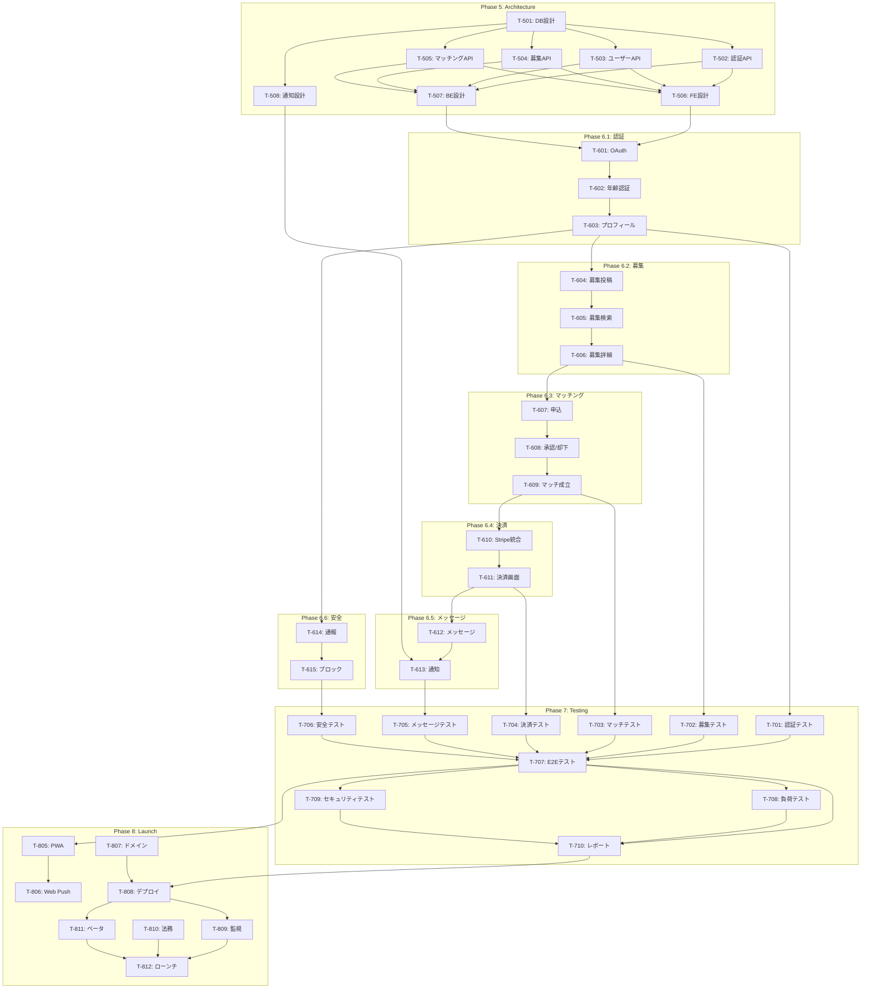

# タスク分解 - golf_yy

**作成日:** 2026-01-02
**バージョン:** 1.0
**全タスク数:** 54

---

## タスク一覧サマリー

| フェーズ | タスク数 | タスクID範囲 | 主な内容 |
|---------|---------|-------------|---------|
| Phase 5: Architecture Design | 8 | T-501〜T-508 | DB設計、API仕様、設計 |
| Phase 6: Implementation | 15 | T-601〜T-615 | 全機能実装 |
| Phase 7: Testing | 10 | T-701〜T-710 | テスト |
| Phase 8: Launch Preparation | 12 | T-801〜T-812 | ローンチ準備 |

---

## Phase 5: Architecture Design

### T-501: データベース設計

**完了基準:**
- [ ] ER図作成完了
- [ ] テーブル定義書作成（全テーブル）
- [ ] インデックス設計完了
- [ ] Supabase Migrationファイル作成

**依存タスク:** なし
**ブロッカー:** なし

**対象テーブル:**
- users（ユーザー）
- profiles（プロフィール）
- rounds（ラウンド募集）
- applications（参加申込）
- matches（マッチ）
- messages（メッセージ）
- payments（決済履歴）
- reports（通報）
- blocks（ブロック）

---

### T-502: 認証API仕様書作成

**完了基準:**
- [ ] OpenAPI 3.0形式で仕様書作成
- [ ] エンドポイント定義完了
- [ ] リクエスト/レスポンススキーマ定義
- [ ] エラーコード定義

**依存タスク:** T-501
**ブロッカー:** なし

**対象エンドポイント:**
- POST /auth/google
- POST /auth/apple
- POST /auth/line
- POST /auth/logout
- GET /auth/me

---

### T-503: ユーザー・プロフィールAPI仕様書作成

**完了基準:**
- [ ] OpenAPI 3.0形式で仕様書作成
- [ ] CRUD操作の定義完了
- [ ] バリデーションルール定義

**依存タスク:** T-501
**ブロッカー:** なし

**対象エンドポイント:**
- GET /users/:id
- PUT /users/:id/profile
- POST /users/:id/profile/image

---

### T-504: ラウンド募集API仕様書作成

**完了基準:**
- [ ] OpenAPI 3.0形式で仕様書作成
- [ ] 検索フィルター仕様定義
- [ ] ページネーション仕様定義

**依存タスク:** T-501
**ブロッカー:** なし

**対象エンドポイント:**
- GET /rounds（検索）
- GET /rounds/:id
- POST /rounds
- PUT /rounds/:id
- DELETE /rounds/:id

---

### T-505: マッチング・決済・メッセージAPI仕様書作成

**完了基準:**
- [ ] 申込・承認フローAPI定義
- [ ] Stripe Webhook仕様定義
- [ ] WebSocket/Realtime仕様定義

**依存タスク:** T-501
**ブロッカー:** なし

**対象エンドポイント:**
- POST /rounds/:id/apply
- PUT /applications/:id/approve
- PUT /applications/:id/reject
- POST /payments/checkout
- POST /payments/webhook
- GET /messages/:matchId
- POST /messages/:matchId

---

### T-506: フロントエンド設計

**完了基準:**
- [ ] コンポーネント設計書作成
- [ ] 画面遷移図作成
- [ ] 状態管理設計（Zustand）
- [ ] ディレクトリ構造定義

**依存タスク:** T-502, T-503, T-504, T-505
**ブロッカー:** なし

---

### T-507: バックエンド設計

**完了基準:**
- [ ] Supabase RLS設計
- [ ] Edge Functions設計
- [ ] 認証フロー設計
- [ ] エラーハンドリング設計

**依存タスク:** T-502, T-503, T-504, T-505
**ブロッカー:** なし

---

### T-508: 通知システム設計

**完了基準:**
- [ ] プッシュ通知設計（Web Push）
- [ ] アプリ内通知設計
- [ ] メール通知設計（オプション）
- [ ] 通知テンプレート定義

**依存タスク:** T-501
**ブロッカー:** なし

---

## Phase 6: Implementation

### 6.1 認証・プロフィール

#### T-601: OAuth認証実装

**完了基準:**
- [ ] Google OAuth 2.0統合完了
- [ ] Apple Sign In統合完了
- [ ] LINE Login統合完了
- [ ] JWTトークン発行・検証実装
- [ ] セッション管理（7日間保持）実装
- [ ] ユニットテスト: 認証成功/失敗シナリオ

**依存タスク:** T-506, T-507
**ブロッカー:** なし

---

#### T-602: 年齢認証実装

**完了基準:**
- [ ] 生年月日入力フォーム実装
- [ ] 年齢計算ロジック実装
- [ ] 20代バリデーション実装
- [ ] エラーハンドリング実装
- [ ] ユニットテスト: 境界値テスト（19歳、20歳、29歳、30歳）

**依存タスク:** T-601
**ブロッカー:** なし

---

#### T-603: プロフィール作成実装

**完了基準:**
- [ ] プロフィールフォーム実装（3ステップ）
- [ ] 画像アップロード実装（Supabase Storage）
- [ ] バリデーション実装（必須項目、文字数）
- [ ] プロフィール表示画面実装
- [ ] ユニットテスト: バリデーションテスト

**依存タスク:** T-602
**ブロッカー:** なし

---

### 6.2 ラウンド募集

#### T-604: ラウンド募集投稿実装

**完了基準:**
- [ ] 募集作成フォーム実装
- [ ] 日付選択（カレンダーUI）実装
- [ ] 募集保存API実装
- [ ] 募集編集・削除機能実装
- [ ] ユニットテスト: 日付バリデーション

**依存タスク:** T-603
**ブロッカー:** なし

---

#### T-605: 募集検索実装

**完了基準:**
- [ ] 検索フィルターUI実装
- [ ] 検索API実装（日付、エリア、レベル）
- [ ] 無限スクロール実装
- [ ] 検索結果0件時のUI実装
- [ ] ユニットテスト: フィルタリングロジック

**依存タスク:** T-604
**ブロッカー:** なし

---

#### T-606: 募集詳細画面実装

**完了基準:**
- [ ] 募集詳細表示実装
- [ ] 企画者プロフィール表示実装
- [ ] 参加申込ボタン実装
- [ ] ユニットテスト: 表示ロジック

**依存タスク:** T-605
**ブロッカー:** なし

---

### 6.3 マッチング

#### T-607: 参加申込実装

**完了基準:**
- [ ] 申込ボタン・確認ダイアログ実装
- [ ] 申込API実装
- [ ] 申込一覧画面実装
- [ ] 申込ステータス管理実装
- [ ] ユニットテスト: 重複申込防止

**依存タスク:** T-606
**ブロッカー:** なし

---

#### T-608: 申込者承認・却下実装

**完了基準:**
- [ ] 企画者向け申込一覧実装
- [ ] 承認/却下ボタン実装
- [ ] 承認/却下API実装
- [ ] 定員チェックロジック実装
- [ ] ユニットテスト: 承認フロー

**依存タスク:** T-607
**ブロッカー:** なし

---

#### T-609: マッチ成立処理実装

**完了基準:**
- [ ] マッチ成立判定ロジック実装
- [ ] マッチレコード作成実装
- [ ] 募集ステータス更新実装
- [ ] ユニットテスト: マッチ成立条件

**依存タスク:** T-608
**ブロッカー:** なし

---

### 6.4 決済

#### T-610: Stripe統合実装

**完了基準:**
- [ ] Stripe SDK統合
- [ ] Stripe Checkout設定
- [ ] Webhook受信実装
- [ ] 決済履歴保存実装
- [ ] ユニットテスト: Webhook処理

**依存タスク:** T-609
**ブロッカー:** なし

---

#### T-611: 決済画面実装

**完了基準:**
- [ ] 決済画面UI実装
- [ ] Stripe Checkoutリダイレクト実装
- [ ] 決済成功/失敗画面実装
- [ ] 決済履歴画面実装
- [ ] ユニットテスト: 決済フロー

**依存タスク:** T-610
**ブロッカー:** なし

---

### 6.5 メッセージ

#### T-612: リアルタイムメッセージ実装

**完了基準:**
- [ ] Supabase Realtime設定
- [ ] メッセージ送受信実装
- [ ] チャットUI実装（LINE風）
- [ ] 既読表示実装
- [ ] ユニットテスト: メッセージ送受信

**依存タスク:** T-611
**ブロッカー:** なし

---

#### T-613: メッセージ通知実装

**完了基準:**
- [ ] Web Push通知実装
- [ ] アプリ内通知バッジ実装
- [ ] 通知センター実装
- [ ] ユニットテスト: 通知送信

**依存タスク:** T-612, T-508
**ブロッカー:** なし

---

### 6.6 通報・ブロック

#### T-614: 通報機能実装

**完了基準:**
- [ ] 通報ボタン・理由選択UI実装
- [ ] 通報API実装
- [ ] 管理者向け通報一覧（Supabase Dashboard）
- [ ] ユニットテスト: 通報送信

**依存タスク:** T-603
**ブロッカー:** なし

---

#### T-615: ブロック機能実装

**完了基準:**
- [ ] ブロックボタン・確認ダイアログ実装
- [ ] ブロックAPI実装
- [ ] ブロックユーザー非表示ロジック実装
- [ ] ブロック解除機能実装
- [ ] ユニットテスト: ブロックロジック

**依存タスク:** T-614
**ブロッカー:** なし

---

## Phase 7: Testing

### T-701: 認証・プロフィール統合テスト

**完了基準:**
- [ ] 新規登録フローE2Eテスト
- [ ] ログイン/ログアウトテスト
- [ ] プロフィール作成テスト
- [ ] 年齢認証境界値テスト

**依存タスク:** T-603
**ブロッカー:** なし

---

### T-702: 募集機能統合テスト

**完了基準:**
- [ ] 募集作成→検索→詳細E2Eテスト
- [ ] 募集編集・削除テスト
- [ ] 検索フィルターテスト

**依存タスク:** T-606
**ブロッカー:** なし

---

### T-703: マッチング統合テスト

**完了基準:**
- [ ] 申込→承認→マッチ成立E2Eテスト
- [ ] 申込→却下テスト
- [ ] 定員オーバーテスト

**依存タスク:** T-609
**ブロッカー:** なし

---

### T-704: 決済統合テスト

**完了基準:**
- [ ] Stripeテストモードでの決済E2Eテスト
- [ ] 決済成功→メッセージ解放テスト
- [ ] 決済失敗リトライテスト

**依存タスク:** T-611
**ブロッカー:** なし

---

### T-705: メッセージ統合テスト

**完了基準:**
- [ ] リアルタイムメッセージE2Eテスト
- [ ] 通知受信テスト
- [ ] 既読表示テスト

**依存タスク:** T-613
**ブロッカー:** なし

---

### T-706: 通報・ブロック統合テスト

**完了基準:**
- [ ] 通報送信E2Eテスト
- [ ] ブロック→非表示テスト
- [ ] ブロック解除テスト

**依存タスク:** T-615
**ブロッカー:** なし

---

### T-707: 全体E2Eテスト

**完了基準:**
- [ ] 企画者フロー完全E2E（登録→募集→承認→メッセージ）
- [ ] 申込者フロー完全E2E（登録→検索→申込→決済→メッセージ）
- [ ] クロスブラウザテスト（Chrome, Safari, Firefox）
- [ ] モバイルレスポンシブテスト

**依存タスク:** T-701〜T-706
**ブロッカー:** なし

---

### T-708: 負荷テスト

**完了基準:**
- [ ] 同時接続100ユーザーテスト
- [ ] API応答時間500ms以内確認
- [ ] DB接続プール確認

**依存タスク:** T-707
**ブロッカー:** なし

---

### T-709: セキュリティ脆弱性診断

**完了基準:**
- [ ] OWASP ZAPスキャン実施
- [ ] CSRF対策確認
- [ ] XSS対策確認
- [ ] SQLインジェクション対策確認
- [ ] 脆弱性0件（または修正完了）

**依存タスク:** T-707
**ブロッカー:** なし

---

### T-710: テスト結果レポート作成

**完了基準:**
- [ ] テストカバレッジレポート
- [ ] バグ一覧と修正状況
- [ ] パフォーマンステスト結果
- [ ] セキュリティテスト結果

**依存タスク:** T-707, T-708, T-709
**ブロッカー:** なし

---

## Phase 8: Launch Preparation

### T-801: LP作成

**完了基準:**
- [ ] LP設計（ファーストビュー、特徴、CTA）
- [ ] LP実装
- [ ] レスポンシブ対応
- [ ] OGP設定

**依存タスク:** なし（並列実行可能）
**ブロッカー:** なし

---

### T-802: X広告クリエイティブ作成

**完了基準:**
- [ ] 広告コピー作成（3パターン）
- [ ] 広告画像作成（3パターン）
- [ ] ターゲティング設定

**依存タスク:** なし
**ブロッカー:** なし

---

### T-803: Instagram広告クリエイティブ作成

**完了基準:**
- [ ] ストーリーズ広告作成
- [ ] フィード広告作成
- [ ] ターゲティング設定

**依存タスク:** なし
**ブロッカー:** なし

---

### T-804: X公式アカウント運用開始

**完了基準:**
- [ ] アカウント作成
- [ ] プロフィール設定
- [ ] 初期投稿5件作成
- [ ] フォロワー獲得施策開始

**依存タスク:** なし
**ブロッカー:** なし

---

### T-805: PWAマニフェスト設定

**完了基準:**
- [ ] manifest.json作成
- [ ] Service Worker設定
- [ ] アイコン作成（各サイズ）
- [ ] オフライン対応（基本）

**依存タスク:** T-707
**ブロッカー:** なし

---

### T-806: Web Push通知設定

**完了基準:**
- [ ] VAPID鍵生成
- [ ] 通知許可フロー実装
- [ ] 通知送信テスト

**依存タスク:** T-805
**ブロッカー:** なし

---

### T-807: ドメイン・SSL設定

**完了基準:**
- [ ] ドメイン取得
- [ ] DNS設定
- [ ] SSL証明書設定（Vercel自動）
- [ ] リダイレクト設定

**依存タスク:** なし
**ブロッカー:** なし

---

### T-808: 本番環境デプロイ

**完了基準:**
- [ ] Vercel本番デプロイ
- [ ] Supabase本番プロジェクト設定
- [ ] Stripe本番APIキー設定
- [ ] 環境変数設定完了

**依存タスク:** T-710, T-807
**ブロッカー:** なし

---

### T-809: 運用ダッシュボード設定

**完了基準:**
- [ ] Google Analytics設定
- [ ] エラー監視設定（Sentry）
- [ ] アラート設定

**依存タスク:** T-808
**ブロッカー:** なし

---

### T-810: 利用規約・プライバシーポリシー作成

**完了基準:**
- [ ] 利用規約作成
- [ ] プライバシーポリシー作成
- [ ] 特定商取引法に基づく表記作成
- [ ] サイトへの掲載

**依存タスク:** なし
**ブロッカー:** なし

---

### T-811: ベータテスト実施

**完了基準:**
- [ ] ベータテスター10人招待
- [ ] フィードバック収集
- [ ] 重大バグ修正
- [ ] UX改善

**依存タスク:** T-808
**ブロッカー:** なし

---

### T-812: ローンチ

**完了基準:**
- [ ] 本番公開
- [ ] X/Instagram広告開始
- [ ] 初期ユーザー獲得開始
- [ ] KPIモニタリング開始

**依存タスク:** T-809, T-810, T-811
**ブロッカー:** なし

---

## 依存関係図



---

## 進捗管理

### 進捗指標

| 指標 | 計算式 | 現在値 |
|------|--------|--------|
| タスク完了率 | 完了タスク / 全タスク | 0/54 (0%) |
| フェーズ進捗 | 完了フェーズ / 全フェーズ | 0/4 |
| ブロッカー数 | 未解決ブロッカー | 0 |
| テスト通過率 | Passing / All | - |

### マイルストーン

| マイルストーン | 完了タスク | 目標 |
|--------------|-----------|------|
| Phase 5完了 | T-501〜T-508 | Week 1 |
| Phase 6.1完了 | T-601〜T-603 | Week 2 |
| Phase 6.2-6.3完了 | T-604〜T-609 | Week 3 |
| Phase 6.4-6.6完了 | T-610〜T-615 | Week 4 |
| Phase 7完了 | T-701〜T-710 | Week 5 |
| Phase 8完了 | T-801〜T-812 | Week 6 |
| **ローンチ** | T-812 | **Week 7** |

---

## ブロッカー管理

| ID | タスク | ブロック理由 | 解決策 | ステータス |
|----|--------|-------------|--------|-----------|
| - | - | - | - | - |

---

## 週次進捗レポートテンプレート

```markdown
# 週次進捗レポート - Week X

## サマリー
- タスク完了率: X/54 (X%)
- 今週完了: T-XXX, T-YYY, T-ZZZ
- 来週予定: T-AAA, T-BBB, T-CCC

## ブロッカー
- なし / あり（詳細）

## リスク
- なし / あり（詳細）

## 所感
- （フリーテキスト）
```

---

## 変更履歴

| バージョン | 日付 | 変更内容 | 担当 |
|-----------|------|---------|------|
| 1.0 | 2026-01-02 | 初版作成 | Planner Agent |
